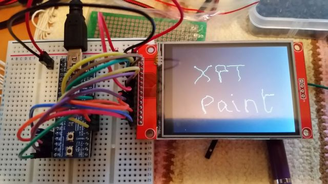

# XPT2046

Arduino library for XPT2046 / ADS7843 touchscreen driver updated for Maple Leaf Mini (STM32F1) and multiple SPI port selection, on the Arduino IDE 1.6.5 (or later).

Forked from Spiros Papadimitriou's excellent XPT2046 library repo [spapadim/XPT2046](https://github.com/spapadim/XPT2046).

Trying to get the [TJCTM24024-SPI](http://www.elecfreaks.com/store/24-tft-lcd-tft0124sp-p-785.html) touch (XPT2046/ADS7843) and TFT (ILI9341) to work together on a [Maple Leaf Mini STM32F1](http://www.leaflabs.com/about-maple/) doesn't work using the same HW SPI interface. The Adafruit_ILI9341_STM library in the Maple Leaf [Arduino STM32 libraries](https://github.com/rogerclarkmelbourne/Arduino_STM32) runs the Hardware SPI too fast for the Touch SPI interface. Also, the Arduino STM32 SPI library doesn't support the `transfer16(uint16_t value)` function available in newer, standard Arduino IDE installations for Arduino boards.

In addition to the original class constructor, I have added a new one that let's you select the SPI port to use.
```
  XPT2046 (uint8_t cs_pin, uint8_t irq_pin);                          // Original
  XPT2046 (uint8_t cs_pin, uint8_t irq_pin, uint32_t spiPortNumber);  // New
```

Using the original constructor will result in SPI Port 1 on the Maple Leaf Mini STM32F1 being selected, as in Spiros' original implementation.

Using the second constructor, a different Hardware SPI port can be selected. I have tested it with SPI Port 2.

The Examples included with the library have also now been updated. For example, here is XPTPaint:


